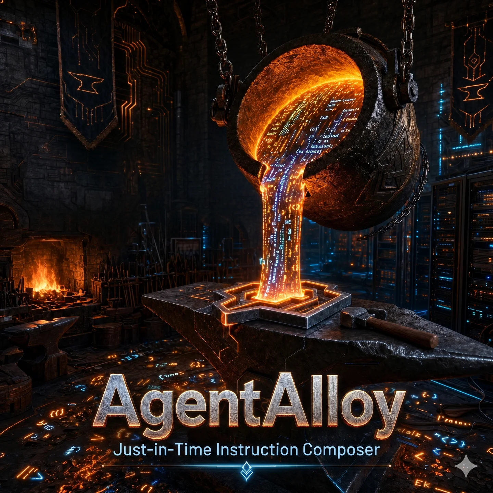

<div align="center">



<br/>

<b>The local interpreter drives the queries. The skill corpus supplies the context. The code index grounds it in your repo. The knowledge graph explains the why.<br/>
AgentAlloy is the Agent OS your harness plugs into — and it runs on your machine.</b>

</div>

<p align="center">
  <a href="LICENSE"></a>
  &nbsp;
  
  &nbsp;
  
  &nbsp;
  <a href="https://github.com/astral-sh/uv"></a>
  &nbsp;
  
  &nbsp;
  
  &nbsp;
  
  &nbsp;
  
</p>

---

Coding agents don't fail for lack of intelligence — they fail for lack of **context**: the rules of your shop, the skills your stack demands, and the ground truth of the code that's already there. `AGENTS.md`, `SKILL.md`, and giant static system prompts were a clever first attempt at supplying it — and they're already breaking. They load once at session start, then rot as the conversation drifts from the script; reloading them every turn just trades drift for token waste.

**AgentAlloy** is the **Agent OS** for local-first engineering: one local platform your coding harness — Claude Code, Codex, Qwen Code, Cursor, or any MCP client — plugs into. It has three context legs and a local execution layer:

- **Instructions** — knows *how you work*. A signal layer watches for the moments that matter — a new task, a phase change, a meaningful file edit — and composes the governance rules, workflow guidance, and domain skills (from a curated ~350-skill corpus across 41 packs) that fit *this* moment. Nothing changed means nothing injected.
- **Code** — knows *what's there*. A local code-intelligence service: your repos parsed into a symbol graph with hybrid semantic/lexical search — exact call graphs and budgeted context bundles, served over a 15-tool execution surface. The agent **queries it**; nothing is pushed.
- **Knowledge** — knows *why it's that way*. A typed decision layer over the same code index: a deterministic `_index_decisions` pass links each decision (`docs/solutions/*.md`, `approach.md`) to the code symbols it governs. Query it on demand or let it push at design/build.
- **Execution (new in v11)** — knows *how to act*. A local **LFM2.5-2.6B interpreter** drives a read-only query protocol in-process: it classifies the question, fills the arguments, executes against the index, loops or stops, and answers — **zero cloud tokens**. This is what turns a context *engine* into an Agent *OS*.

It attaches as a **local steering proxy**: your harness points its base URL at AgentAlloy and every request flows through with the right context composed in — for Claude Code, wiring sets a single env var and your own credentials pass through untouched. Smaller models get leverage they don't have alone; larger models get your actual house rules and a way to interrogate your actual codebase and its decisions — instead of their best guess.

**Everything runs on your machine.** One small embed model, a local interpreter, and an embedded OverGraph store + Tantivy BM25 index. No cloud calls, and — for the intelligence layer — **zero paid-LLM tokens**: routing is deterministic by default, and the one optional LM stage in the compose path is hardware-gated and fails open ([numbers](BENCHMARKS.md)). The structured SDD workflow (spec → design → plan → build → qa → ship) is per-repo and **opt-out**.

Composed into the prompt without you pasting a thing:

- "How do I write a failing pytest before the implementation?" — TDD workflow + framework idioms, from `pytest` + `testing` packs.
- "Wire OpenTelemetry into this FastAPI app." — observability rules + framework patterns, from `fastapi` + `analytics` packs.
- "What breaks if I change this function's signature?" — `code_search` + `symbols` return exact transitive call sites, not a grep guess.

---

## What changed in v11

v11 is the **Agent OS**: the v10 product shell (install runbook, setup wizard, harness wiring, SDD flow, container, release automation, docs) wired to the v2 **execution stack**.

| | v10 (context engine) | **v11 (Agent OS)** |
|---|---|---|
| Execution | Proxy-only; the harness model does the work | **Local LFM2.5-2.6B interpreter** drives the query protocol; optional **DSpark** speculative drafter |
| Surface | Vite web app | **In-app dashboard** at `/dashboard` (retires `frontend/`) |
| Ports | one process on `47950` (+ `47951`/`47952`) | **service `48950` · proxy `48953` · embed `48951` · model `50001`** |
| Intelligence | Retrieved, not executed | **Local Agent Mode**: the 2B model runs a 10-action read-only protocol, opt-in, zero cloud tokens |
| Code index | Pure Python | **Rust core** (`agentalloy-core`, maturin-built) for parse/retrieve/fusion |
| MCP | single `get_skill_for` tool | **slim (2) / full (15)** tool surface, all delegating to `/tool` |
| Version | 10.x | **11.0.0** (major — the cutover) |

Everything from v10 that was the *product* — the install runbook, the setup wizard, harness wiring, the SDD phase/workflow flow, profiles, telemetry, the container, the release automation, the docs — survives. What's new is that the **execution** now runs locally and autonomously, and the harness surface grew to a 16-harness registry (adds `manual` + `mcp-only`, splits Continue into `continue-closed`/`continue-local`), all re-pointed at the new ports.

> **TheForge is the reference deployment.** AgentAlloy's `/tool` byte-compat contract is machine-enforced by `tests/api/test_http_byte_compat.py`, so the skill corpus, code index, and knowledge graph behave identically across installs. See [BENCHMARKS.md](BENCHMARKS.md).

---

## Contents

- [Getting started](#getting-started)
- [Architecture](#architecture)
- [How it works: phases, contracts, signal layer](#how-it-works-phases-contracts-signal-layer)
- [Local Agent Mode](#local-agent-mode)
- [Code index](#code-index)
- [Knowledge module (decisions)](#knowledge-module-decisions)
- [Dashboard](#dashboard)
- [How to use it](#how-to-use-it)
- [Profiles](#profiles-user-scoped-skill-contexts)
- [Harness support](#harness-support)
- [Standalone CLI](#standalone-cli)
- [REST API](#rest-api)
- [MCP Server](#mcp-server)
- [Packs shipping in-tree](#packs-shipping-in-tree)
- [Model stack & ports](#model-stack--ports)
- [Telemetry](#telemetry)
- [Configuration](#configuration)
- [Development](#development)
- [Release status](#release-status)
- [Benchmarks](#benchmarks)
- [Need Help?](#need-help)
- [Contributing](#contributing)
- [License](#license)

---

## Getting started

Two doors — pick the one that's you:

### New to AgentAlloy

```bash
curl -LsSf https://astral.sh/uv/install.sh | sh                   # 1. install uv (Linux / macOS)
uv tool install git+https://github.com/nrmeyers/agentalloy.git    # 2. install the agentalloy CLI
agentalloy setup                                                  # 3. run the setup wizard
cd /path/to/your/repo && agentalloy add claude-code              # 4. add each project (per-repo)
```

The wizard detects your hardware, downloads the GGUF models (LFM2.5-2.6B interpreter, optional DSpark drafter, nomic-embed-text-v1.5), starts the embed server, lets you pick skill packs, wires your harness, and validates the result — **3–5 minutes** on a warm machine. Its first question is **how to deploy**: **Container** (default — one GHCR image, zero host-side inference dependencies) or **Native** (llama-server on your host, GPU acceleration). Trade-offs and the full runbook — scripted flags, air-gapped installs — live in **[INSTALL.md](INSTALL.md)**.

Scripted installs skip the wizard: `agentalloy setup -n --hardware nvidia --packs all --harness claude-code` (native) or `agentalloy setup -n --deployment container --harness claude-code`.

### Already running AgentAlloy

```bash
agentalloy upgrade            # move to the latest release — native or container, auto-detected; preflight + confirm
agentalloy upgrade --check    # report current vs latest, change nothing
```

> **v11 is a cutover, not an in-place migration.** `agentalloy upgrade --check` on a 10.x install reports a **total replacement** — v11 is a fresh install. There is no v10 → v11 state migration; re-run `setup` + `add` on a clean install.

---

## Architecture

v11 runs as **one local platform with two cooperating processes** (plus your upstream model):

```
              Your coding harness
   ┌────────────────────────────────────────────────┐
   │  Claude Code · Codex · Qwen Code · Cursor · …  │
   └─────────────────────────┬──────────────────────┘
                             │  OpenAI / Anthropic / Responses API
                             ▼
   ┌──────────────────────────────────────────────────────────────┐
   │  STEERING PROXY  :48953        (agentalloy proxy)            │
   │  intercepts the request → pulls composed skills from the     │
   │  service → injects → forwards to your upstream model         │
   └─────────────────────────┬────────────────────────────────────┘
                             │  http://127.0.0.1:48950 (compose / retrieve)
                             ▼
   ┌──────────────────────────────────────────────────────────────┐
   │  SERVICE  :48950          (agentalloy serve)                 │
   │                                                              │
   │   In-App Dashboard /dashboard          MCP Bridge (slim/full)│
   │   /tool  ·  /code/*  ·  /compose  ·  /local-agent  ·  /status│
   │                                                              │
   │  ┌─────────────────┐  ┌─────────────────┐  ┌──────────────┐  │
   │  │ Signal layer    │  │ Code Index      │  │ Knowledge    │  │
   │  │ (gates, intents)│  │ (Rust core)     │  │ Graph        │  │
   │  └────────┬────────┘  └────────┬────────┘  └──────┬───────┘  │
   │           └────────────────────┼──────────────────┘          │
   │                                ▼                             │
   │   ┌────────────────────────────────────────────────────────┐ │
   │   │  Skill Corpus (OverGraph + Tantivy BM25)               │ │
   │   │  41 packs · ~350 skills · versions · fragments · embeds│ │
   │   └────────────────────────────────────────────────────────┘ │
   │                                                              │
   │   Local Agent (opt-in) ─ LFM2.5-2.6B interpreter :50001      │
   │   SDD Flow ─ phase · workflow · task · approve               │
   └──────────────────────────────────────────────────────────────┘
                             │
            ┌────────────────┼─────────────────┐
            ▼                ▼                 ▼
      nomic-embed      llama-server      your upstream
       :48951           :50001          (local or cloud)
```

- **Steering Proxy (`:48953`)** — transparent, token-accurate OpenAI-compatible endpoint, plus the native Anthropic (`/v1/messages`) and OpenAI Responses (`/v1/responses`) passthrough paths. It calls the service to compose context, injects it into the prompt, and forwards to your upstream model. This is the surface your harness points at.
- **Service (`:48950`)** — the brain. Serves the instruction injector (`compose`/`retrieve`/`recommend`), the code index (`/code/*`, `/tool`), the knowledge graph, the dashboard (`/dashboard`), the local agent (`/local-agent/*`), and capability readiness (`/status`).
- **Skill Corpus** — ~350 production-validated skills across 41 packs, versions and dependencies tracked in an embedded OverGraph store with HNSW embeddings and a BM25 sidecar. The serving process opens it read-only so re-embedding can hold the single writer lock.
- **Code Index** — per-repo, git-driven; tree-sitter symbol extraction with a Rust core for the hot path; hybrid dense + BM25 + PageRank retrieval; the 15-tool `execute_tool` chain.
- **Knowledge Graph** — links decisions in your code so the agent can answer *"why was this built this way?"* and *"what's related to this?"*
- **Local Agent (opt-in)** — the LFM2.5-2.6B interpreter runs a read-only query protocol in-process (see [Local Agent Mode](#local-agent-mode)).
- **SDD Flow** — the structured spec → design → plan → build → QA → ship workflow, driven by `phase`, `workflow`, `task`, and `approve`.

---

## How it works: phases, contracts, signal layer

Three small artifacts drive everything AgentAlloy does. None of them belong to your agent's prompt — they're state the signal layer reads.

**The phase store.** Phase lives in a per-repo DuckDB state store. Each phase tracks `intake → spec → design → build → qa → ship` — plus a **fast lane** (`sdd-fast`, a compressed spec-design-build for small tasks) and an **add-skill lane** (guided, human-approved custom-skill authoring). Each phase's workflow skill is injected as the persona until its declarative exit gates pass; `spec → design` and `design → build` additionally require an explicit `agentalloy approve <phase>` sign-off. The lifecycle is per-repo and opt-out (`agentalloy add <harness> --lifecycle-mode off`), and `agentalloy workflow pause` pauses all workflow steering — domain skills keep composing — until `workflow resume`. Lanes, lifecycle modes, and the full gate inventory: [docs/operator.md](docs/operator.md#phases).

**Task contracts.** A short markdown file (`.agentalloy/contracts/<phase>/<task>.md`) the agent writes once at task start, declaring `domain_tags`, scope, and success criteria in its frontmatter. From then on, **`domain_tags` is the BM25 input for retrieval** — surgical, intent-aware, and stable across the conversation. Schema and a full example: [docs/operator.md](docs/operator.md#contracts).

**The signal layer.** A small deterministic Python module that wakes on three events — a user prompt, a contract write, a tool about to fire. A cheap pre-filter exits silently when nothing matches (no tokens spent, no injection); otherwise it evaluates the active phase's exit gates — deterministic predicates (`artifact_exists`, `git_state`, `contract_has_tags`) plus a named-intent classifier — then atomically advances the phase (injecting the next workflow skill) or fires a system skill (commit-safety, secret-handling). Zero paid-LLM tokens spent on "where am I?" Internals: [docs/operator.md](docs/operator.md#signal-layer) and [docs/proxy-architecture.md](docs/proxy-architecture.md).

**What makes the composition different**

- **Composed per task, not loaded every turn.** A skill that's irrelevant to the current task isn't in the prompt at all — RRF + applicability filtering picks the right subset for each request.
- **Three instruction sets, fused.** Governance, workflow, and domain skills are composed together into one persona.
- **Phase-aware.** Phase sets the candidate budget and the dense-vs-lexical fusion weights — QA biases lexical, spec biases dense. Retrieval itself is phase-agnostic: no hard phase→category gate.
- **Hybrid retrieval, not lexical-only.** Token-literal queries (`"JWT"`) hit BM25; semantic queries ("the auth handler") hit the dense leg. Phase-tuned Reciprocal Rank Fusion picks the better signal per query.
- **No model variance by default.** Embeddings + lexical match + deterministic fusion mean the same task → same composition, regardless of which agent model you swap in tomorrow. The optional fragment re-ranker is the only non-deterministic element — hardware-gated, always fail-open.
- **Versioned & validated.** Every skill is sourced from authoritative upstream docs and validated against the R1–R8 quality contract (`src/agentalloy/_packs/meta/sys-skill-authoring-rules.md`).

---

## Local Agent Mode

The v11 execution layer. A question goes to the service; the **local LFM2.5-2.6B** interpreter — *not* the harness's cloud model — classifies it into one of **10 read-only actions**, fills the arguments under that action's JSON schema, the service executes the query **in-process**, the model decides loop-or-stop, and finally generates an answer from what was retrieved. **Zero cloud tokens**; the harness keeps its cloud model for writing code.

- Ships **off by default**. When on, it adds only `POST /local-agent/ask` and `GET /local-agent/health`.
- The 10 actions mirror the code-intelligence surface: `code_search`, `symbols`, `knowledge_why`, `knowledge_related`, `knowledge_entities`, `artifact_body`, `contract_detail`, `telemetry`, `get_skill_for`, `none`.
- The loop is a pure, model-client-injected state machine (classify → fill → validate → execute → loop|stop) with total termination (`none` / `step_budget` / `duplicate` / `*_failed`).
- Two failure postures: an **unavailable LM stage** latches a structured 503; an **answered-but-wrong stage** fails open with `degraded=true` and the raw step results, never fabricated — index-grounded validation rejects a hallucinated FQN/slug before it can execute.

```bash
agentalloy ask "why does the auth flow retry twice?"
# → interpreter classifies → knowledge_why(auth_middleware) → answer, 0 cloud tokens
```

> _Local Agent Mode is an opt-in v11 capability being folded into the mainline. Design and protocol: [docs/local-agent-v2.md](docs/local-agent-v2.md)._

---

## Code index

A context module alongside skill composition: a tree-sitter symbol graph plus hybrid semantic/lexical search over **your own repos**, served under `/code/*` and the `/tool` execution surface on the service port. Off by default — enable it in the setup wizard, run `agentalloy config enable code-index` post-install (no reinstall needed), or set `CODE_INDEX_ENABLED=1`. The module's dependencies live behind the `[code-index]` extra; the container image ships it preinstalled. **This one toggle covers Knowledge too** — the decision-graph layer rides the same index with no separate switch.

```bash
agentalloy code index                      # index the current repo (incremental; --force for full)
agentalloy code search "where are auth tokens validated"
agentalloy code symbols <fqn>              # symbol details + qualified name
agentalloy code bundle "<task>"            # budgeted context bundle for a task
agentalloy code status                     # indexed repos + active jobs + staleness
```

Indexes are per-repo under `~/.local/share/agentalloy/code_index/` (OverGraph symbol graph + vector index) and reuse the same local embed server as the skill corpus. The `/tool` surface exposes a **15-tool `execute_tool` chain** (`graph_query` + 10 knowledge tools); `/status` reports *truthful* readiness flags — `graph_ready` / `knowledge_ready` flip from wiring success (never hardcoded), while `rerank` and `jobs` are roadmap (currently `false`). When the module is enabled, `agentalloy add` writes a small code-index block into the repo's agent instructions and offers to index an unindexed repo on the spot. See [docs/code-index.md](docs/code-index.md) for the endpoint table, CLI reference, and storage layout.

---

## Knowledge module (decisions)

The third context leg: not just *what's there* (Code) but ***why it's that way***. A typed decision layer riding on the same code index — no separate store, no new process, and (see above) no separate toggle.

**How a decision gets there.** Nothing new to author. AgentAlloy's own SDD lifecycle already writes the "why" as it runs — a task's lesson (`docs/solutions/<slug>.md`, gated at qa) and the design phase's `approach.md`. A deterministic `_index_decisions` pass links each decision (a heading-chunk of one of those docs) to the code symbols it names — no LLM, no schema migration, incremental with the rest of the index.

```bash
agentalloy knowledge why <fqn>              # decisions governing a symbol — pull it on demand
```

**And it doesn't wait to be asked.** At design/build, when a work-item's `scope.touches` covers code a decision governs, that decision's rationale is composed into context on the cursor-entry turn — automatically, once per work-item, no query required. Two guarantees: a `superseded` decision never surfaces, and if the decision's already been promoted to a domain skill (`agentalloy lessons promote`), Knowledge defers to it instead of double-injecting.

**Fail-closed.** Module off, repo unindexed, or nothing in scope governed — composition is byte-identical to Knowledge not existing. It's additive, never a new failure mode.

Full mechanism (the JIT push, dedup rules, incremental re-link, the query API): [docs/code-index.md](docs/code-index.md#knowledge-layer-decisions) and [docs/codeindex-knowledge-graph.md](docs/codeindex-knowledge-graph.md).

---

## Dashboard

The in-app dashboard ships in the same service process at [http://localhost:48950/dashboard](http://localhost:48950/dashboard) — no extra daemon, localhost-only, no auth. It's a static UI served by the service (it retires the old Vite `frontend/`): service status, capability readiness, sessions, and the SDD flow (phases, gate blockers, sign-off queue) in one place.

---

## How to use it

Four paths, depending on how your harness integrates with external tools.

**Standalone HTTP service.** Run the service on its own and call `POST /compose` or the `/tool` surface from anything — an agent, a script, CI. `agentalloy serve` binds `:48950`; `curl -s localhost:48950/health` confirms it's up.

**Proxy-wired harness (full integration).** If your harness honors a custom API base URL, `agentalloy add <name>` points it at the local steering proxy (`http://localhost:48953/…`) and adopts the harness's existing upstream, so you never re-declare it: every LLM request flows through with skills injected and gates evaluated. Claude Code wiring is **auth-transparent** — it sets only `ANTHROPIC_BASE_URL` (a per-repo `/proj/<token>` URL), never an API key, so your own credential (including account/OAuth auth) passes through verbatim; and the upstream is configurable (`ANTHROPIC_UPSTREAM_URL`), so any Anthropic-compatible provider or a chained proxy works. Wiring mechanics: [docs/install/harness-catalog.md](docs/install/harness-catalog.md).

**Parallel sessions with git worktrees.** `agentalloy worktree <harness> <branch> -b` creates the worktree and wires it in one shot; each worktree's distinct path gets its own `/proj/<token>` — its own phase, its own upstream — while all worktrees share the one running service and corpus. Corpus mutations (`install-packs`, `reembed`) take the single-writer lock and affect every worktree, so stop the service before running them.

**Sidecar harness.** Cursor, Windsurf, GitHub Copilot, and Antigravity CLI route through their own backends and can't be intercepted. For those, `agentalloy add` writes a static rules file and the running service's in-process store hook keeps it regenerated within ~1s of a phase change. Capability matrix: [Harness support](#harness-support).

---

## Profiles: user-scoped skill contexts

Profiles let you maintain separate skill contexts for different kinds of work — e.g. a `work` profile with stricter CI gates and team governance rules, a `personal` profile with relaxed constraints and hobby-project domain skills. Profiles auto-resolve per-repo based on git remote URL, filesystem path, or an explicit project marker, so you never need to switch them manually.

This is the key difference from `AGENTS.md` / `SKILL.md` approaches: the **install is one-time and user-scoped** (state under `~/.config/agentalloy/`, data under `~/.local/share/agentalloy/`) and profiles determine skill overrides per-repo — only the **wiring** is per-repo (`agentalloy add` injects sentinels into each project's harness config files; the skills those sentinels reference come from the user-scoped profile). Full details: [docs/profiles-and-overrides.md](docs/profiles-and-overrides.md).

---

## Harness support

v11 wires **16 harnesses** plus an MCP fallback, all re-pointed at the new ports. They fall into two integration categories:

- **Proxy-wired** (Claude Code, Aider, Cline, Codex, Continue, OpenClaw, OpenCode, Hermes Agent, Copilot CLI, Qwen Code) — full per-turn integration via the local steering proxy. The proxy intercepts LLM traffic, injects skill context, and evaluates gates automatically. Codex rides the native [OpenAI Responses passthrough](docs/responses-surface.md) (`/proj/<token>/v1/responses`).
- **Sidecar** (Cursor, Windsurf, Antigravity) — static rules file kept current by the service's in-process store hook (fires post-commit on phase change). Reduced capability: no enforcement, advisory text only.
- **MCP / manual** (`mcp-only`, `manual`) — for harnesses that speak MCP instead of taking a proxy, or that you wire by hand.

The 16-harness registry: `aider`, `antigravity`, `claude-code`, `cline`, `codex`, `continue-closed`, `continue-local`, `cursor`, `github-copilot`, `hermes-agent`, `manual`, `mcp-only`, `openclaw`, `opencode`, `qwen-code`, `windsurf`.

> Copilot has two surfaces: the standalone **Copilot CLI** is proxy-wired via its BYOK env vars (`COPILOT_PROVIDER_*`), and the VS Code surface (`github-copilot`) is dual-carrier (BYOK "Custom Endpoint" + the instructions-file sidecar). In both BYOK modes, model traffic routes to your configured upstream key, not your Copilot subscription.

Proxy-wired is the preferred mode. Full per-harness catalog and the capability matrix: [docs/install/harness-catalog.md](docs/install/harness-catalog.md) and [docs/harness-classification.md](docs/harness-classification.md).

---

## Standalone CLI

One `agentalloy` command. The everyday surface:

| Group | Commands |
|---|---|
| **Setup & install** | `setup` · `add` · `unwire` · `worktree` · `doctor` · `upgrade` |
| **Run** | `serve` · `proxy` · `server-start` / `server-stop` / `server-status` · `status` |
| **Ask** | `ask` (local agent) · `sessions` |
| **Code intelligence** | `code` · `index` · `knowledge` |
| **SDD flow** | `phase` · `workflow` · `task` · `approve` · `stream` |
| **Integrations** | `mcp` · `upstream` |
| **Operator** | `profile` · `config` · `telemetry` · `lessons` |

Examples:

```bash
agentalloy status                          # service + capability readiness
agentalloy ask "why does the auth flow retry twice?"   # local agent, 0 cloud tokens
agentalloy code search "token refresh"     # hybrid symbol + text search
agentalloy knowledge why src/auth/middleware.py
agentalloy workflow start "Add SSO"        # open an SDD task
agentalloy phase approve                   # clear the human gate
agentalloy compose --contract <path>       # one-shot composition
```

Each subcommand emits structured JSON on stdout; pair with `jq` for scripting. The full surface — power-user install steps (`reembed`, `seed-corpus`, `validate-pack`, `pull-models`, `write-env`, …) is one `--help` away: `agentalloy --help`. Reference: [docs/operator.md](docs/operator.md).

---

## REST API

The service (`:48950`) and proxy (`:48953`) serve:

- `POST /proj/{token}/v1/messages` — native Anthropic passthrough (auth-transparent, per-repo `{token}` discriminator, no translation).
- `POST /v1/chat/completions` — OpenAI-compatible.
- `POST /proj/{token}/v1/responses` — native [OpenAI Responses passthrough](docs/responses-surface.md) (auth-transparent).
- `POST /compose` — manual skill composition.
- `POST /tool` — the 15-tool `execute_tool` chain (`graph_query` + knowledge tools); the byte-compat contract surface.
- `/code/*` — code-index endpoints (when enabled).
- `POST /local-agent/ask` · `GET /local-agent/health` — Local Agent Mode (when enabled).
- `GET /status` — capability readiness flags (`graph_ready`, `knowledge_ready`, …).
- `GET /health` — liveness.

Full endpoint table and request/response shapes: [docs/proxy-surfaces.md](docs/proxy-surfaces.md) and [docs/code-index.md](docs/code-index.md).

---

## MCP Server

For harnesses that speak the Model Context Protocol instead of taking a proxy, `agentalloy mcp` runs a built-in stdio MCP server. The surface is **slim by default** — `code_search` + `contract_detail` — and `AGENTALLOY_MCP_TOOLS=full` exposes all 15. Every tool delegates to the service's `/tool` over HTTP (the service holds the only read-write store handle). Wire it with `agentalloy add <name> --mcp-fallback` (supported: Claude Code, Cursor, Continue). Per-harness configuration: [docs/install/harness-catalog.md](docs/install/harness-catalog.md#mcp-fallback).

---

## Packs shipping in-tree

The corpus is **packs** — opt-in groups of related skills. `main` ships **41 packs / ~350 skills** organized across 9 tiers:

<table>
<tr><th>Tier</th><th>Packs</th></tr>
<tr><td><b>foundation</b></td><td><code>core</code> · <code>documentation</code> · <code>engineering</code> · <code>performance</code> · <code>refactoring</code> · <code>sys</code> · <code>conventions</code></td></tr>
<tr><td><b>language</b></td><td><code>csharp-dotnet</code> · <code>go</code> · <code>java</code> · <code>nodejs</code> · <code>python</code> · <code>rust</code> · <code>typescript</code></td></tr>
<tr><td><b>framework</b></td><td><code>fastapi</code> · <code>fastify</code> · <code>nestjs</code> · <code>nextjs</code> · <code>react</code> · <code>vue</code></td></tr>
<tr><td><b>tooling</b></td><td><code>linting</code> · <code>pytest</code> · <code>testing</code> · <code>vite</code> · <code>vitest</code></td></tr>
<tr><td><b>workflow</b></td><td><code>code-review</code> · <code>design-review</code> · <code>intake</code> · <code>sdd</code> · <code>meta</code></td></tr>
<tr><td><b>domain</b></td><td><code>analytics</code> · <code>calendar-ui</code> · <code>data-engineering</code> · <code>ui-design</code></td></tr>
<tr><td><b>platform</b></td><td><code>github-actions</code></td></tr>
<tr><td><b>protocol</b></td><td><code>rest</code> · <code>webhooks</code></td></tr>
<tr><td><b>store</b></td><td><code>redis</code> · <code>redshift</code> · <code>snowflake</code> · <code>temporal</code></td></tr>
</table>

Every skill is sourced from authoritative upstream docs and validated against the **R1–R8 quality contract** (`src/agentalloy/_packs/meta/sys-skill-authoring-rules.md`). Nothing about authoring is required to *use* AgentAlloy at runtime. Contributing: `agentalloy new-skill-pack` and `agentalloy validate-pack` — [docs/corpus-ingest.md](docs/corpus-ingest.md).

---

## Model stack & ports

| Role | Default | Port |
|---|---|---|
| **Service** (compose / dashboard / code index / `/tool`) | — | `48950` |
| **Embeddings** | `nomic-embed-text-v1.5` (Q8_0) | `48951` |
| **Rerank** *(roadmap, off)* | ColBERT | `48952` |
| **Steering Proxy** (harness injection) | — | `48953` |
| **Local interpreter** | `LFM2.5-2.6B-QAD-Q4_0` (+ optional `LFM2.5-2.6B-DSpark-F16` drafter) | `50001` |
| **Upstream** (your main session model) | your local or cloud model | — |

The **interpreter** (`:50001`) is the local orchestrator sidecar — the 2B model that drives the Local Agent protocol. The **upstream** is *your* model (local or cloud) that writes the code; AgentAlloy never ships a default for it. The v1 `47950`/`47951`/`47952` ports retire in v11.

All ports and model names are overridable via `AGENTALLOY_*` env vars (`AGENTALLOY_SERVICE_PORT`, `AGENTALLOY_EMBED_PORT`, `AGENTALLOY_PROXY_PORT`, `AGENTALLOY_MODEL_PORT`, `AGENTALLOY_UPSTREAM_URL`, …); the product shell reads the bare-name v10 vars (`UPSTREAM_URL`, `CODE_INDEX_ENABLED`, `COMPOSE_ENABLED`, …). Full reference: [docs/operator.md](docs/operator.md#configuration).

---

## Telemetry

Every `/compose`, `/retrieve`, signal evaluation, and proxied request writes a structured trace to DuckDB before the response returns; trace-write failures never propagate. Query `GET /telemetry/{traces,savings,coverage}`, aggregate with `agentalloy telemetry savings`, or browse it in the dashboard. Telemetry lives in its own service-owned `telemetry.duck` so runtime trace writes never contend with the re-embed writer. Trace schema and filters: [docs/operator.md](docs/operator.md#telemetry).

---

## Configuration

`agentalloy write-env --preset <cpu|nvidia|radeon|apple-silicon>` renders `~/.config/agentalloy/.env` from a hardware preset (the files under `src/agentalloy/install/presets/` are the source of truth). The keys you'll touch most: `UPSTREAM_URL` / `UPSTREAM_MODEL` / `UPSTREAM_API_KEY` (the global-fallback upstream the proxy forwards to; per-repo `agentalloy add` overrides them) and `RUNTIME_EMBED_BASE_URL` (embedding endpoint, default `http://localhost:48951`). For flipping a single module on or off after install — no full re-render, no reinstall — use `agentalloy config status|enable|disable <feature>` (currently manages `code-index`, which covers Knowledge too). Full key reference, including the `AGENTALLOY_*` execution-stack vars: [docs/operator.md](docs/operator.md#configuration).

---

## Development

```bash
uv sync && uv run pytest -n auto --dist loadgroup      # deps + unit tests (xdist-parallel)
uv run ruff check . && uv run ruff format --check .    # lint + format
uv run pyright                                          # strict type check
uv run maturin develop --release                        # build the Rust core (agentalloy-core)
```

**Pre-commit hooks.** Install once with `uv run pre-commit install` — they auto-fix lint and format on every commit.

**Local CI.** Run the full quality gate locally before pushing:

```bash
scripts/local-ci.sh
```

Integration tests (`uv run pytest -m integration`) need a running nomic-embed llama-server. Branching, CI gates, and where the tests live: [RELEASE.md](RELEASE.md).

---

## Release status

v11.0.0 cuts from `feat/v2-transition` as a `feat!`/BREAKING PR (the version-bot derives the major bump). At the M0 merge the v2 execution stack is in-tree and the v10 shell is restored; the **product shell** — setup wizard, 16 harness wirings, container, and release automation — is finalized across M1–M3. `agentalloy upgrade --check` on a 10.x install reports a total replacement; v11 is a fresh install, not an in-place migration.

---

## Benchmarks

Two result sets stand out:

- **Composition lift.** On a 4-model × 3-condition matrix (composed / flat-oracle / no skills) over 18 pre-registered domain tasks, composed injection beat the bare model on every architecture, capturing most of a hand-picked oracle's lift at 21–32% fewer tokens — automatic selection doing the job a human curator would. The lift is biggest for the small edge model, which also runs more concise.
- **Interpreter gate.** Local Agent Mode's interpreter is measured on the 66-task classify-then-fill gate: MiniCPM5-2B (the engine from 2026-09-11 to 09-14) passed at **66/66 with 0% hallucination**, ahead of the LFM2.5-2.6B baseline (62/66, 3% hallucination). As of 2026-09-14 the engine is LFM2.5-2.6B (QAD-Q4_0) again.

Full matrix, methodology, and caveats in [BENCHMARKS.md](BENCHMARKS.md).

---

## Need Help?

[Installation guide](docs/install/) (per-harness setup) · [Operator guide](docs/operator.md) (CLI reference, service management) · [Troubleshooting](docs/troubleshooting.md) (common errors and fixes) · [Discussions](https://github.com/nrmeyers/agentalloy/discussions)

---

## Contributing

Use an editable install so your changes are reflected immediately: `git clone` the repo, then `uv sync && uv tool install --editable .`. Branching, commit conventions, PR flow, CI gates, and the release process are the contribution runbook: [RELEASE.md](RELEASE.md).

---

## License

MIT. See [LICENSE](LICENSE).
